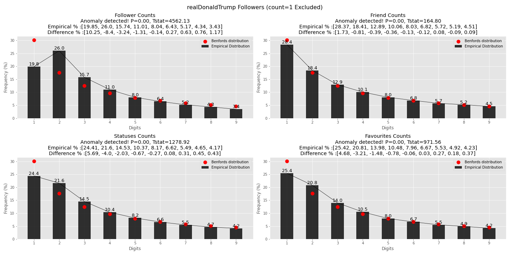
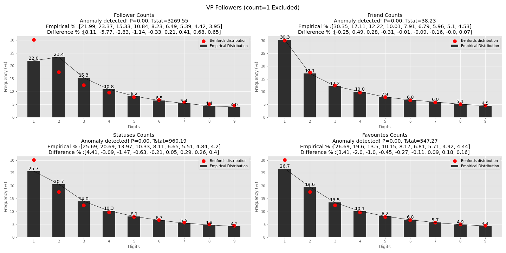
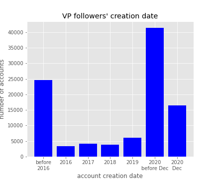
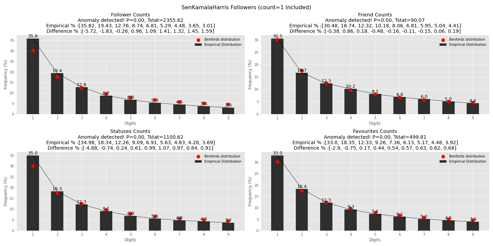
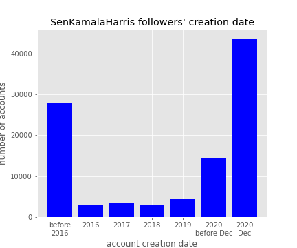
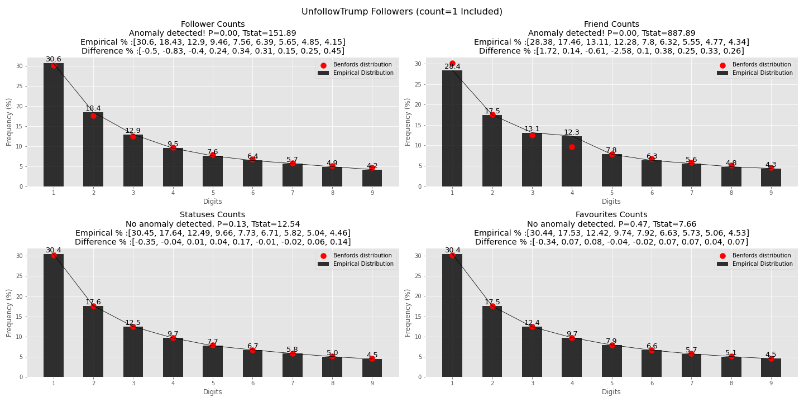
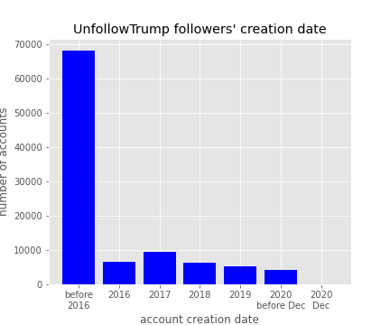

# Twitter Followers & Benford's Law 

Benford's Law is an observation about the frequency distribution of leading digits in many real-life sets of numerical data. The law states that in many naturally occurring collections of numbers, the leading digit is likely to be small.

Benford's law tends to apply most accurately to data that span several orders of magnitude. As a rule of thumb, the more orders of magnitude that the data evenly covers, the more accurately Benford's law applies. 

### Benford's Distribution

This method can be used to test if a set of numbers may be artificial (or manipulated).

 

### Applications Of Benford's Law
* Accounting fraud detection
* Scientific fraud detection
* Macroeconomic data
* Price digit analysis
* Genome data
* Election data
* Legal status

 

## Motivation
In the recent years, Twitter has become one of the major forums of American political discource, we started to hear more about bot farms, propaganda bots, and bots driving online discussions of current events. Here are few headlines to get a flavor of bots on Twitter:

[Russia's manipulation of Twitter was far vaster than believed - politico.com](https://www.politico.com/story/2019/06/05/study-russia-cybersecurity-twitter-1353543)

[Researchers: Nearly Half Of Accounts Tweeting About Coronavirus Are Likely Bots - npr.org](https://www.npr.org/sections/coronavirus-live-updates/2020/05/20/859814085/researchers-nearly-half-of-accounts-tweeting-about-coronavirus-are-likely-bots)

[The role of bot squads in the political propaganda on Twitter - nature.com](https://www.nature.com/articles/s42005-020-0340-4)

A Twitter user's numeric statistics such as follower count, friend count, favorites count, and statuses count should span several orders of magnitude, these counts can vary from zero to millions, therefore Benford's Law should be applicable. 

I wanted to see if applying Benford's Law to Twitter users' followers' numeric data will reveal anything interesting, if this method can tell us about possibilities of bots. 

## Data Source 

I used [Tweepy](https://www.tweepy.org/) to access the Twitter API, and downloaded the 10,000 most recent followers for each of the 6 Twitter profiles I chose. 

I chose the 6 most important political leaders in the U.S., they are:

1. President Donald Trump @realDonaldTrump 

2. President-Elect Joe Biden @JoeBiden

3. VP Mike Pence @VP

4. VP-Elect Kamala Harris @SenKamalaHarris

5. Senate Majority Leader Mitch Mcconell @senatemajldr

6. House Speaker Nancy Pelosi @SpeakerPelosi

From the 60,000 twitter user objects, I extracted the count of their followers, friends(following), favorites, and statuses. I also threw in the user creation date. 

 

## Hypothesis Testing

Null Hypothesis: The 4 numeric statistics of the 10,000 followers of each user follow the Benford's Distribution

Alternate Hypothesis: The 4 numeric statistics of the 10,00 followers of each user don't follow Benford's Distribution

I used a Chi-Square test, and an alpha = 0.05

 

## Findings
Note: count of 0's have been removed from the dataset, since 0 does not have a leading significant digit. 

I ran the chi-square test and graphed them with and without count = 1, and something interesting did emerge. 

As you can see below, if we exclude the data points that are equal to 1, the graphs look a lot different than if we include them. Meaning there are a lot of followers with only count of 1 in their statistics (1 follower, 1 favorited tweet, etc.)

Trump's followers, including count = 1

Trump's followers, not including count = 1

Biden's followers, including count = 1

Biden's followers, not including count = 1

Pence's followers, including count = 1

Pence's followers, not including count = 1

Harris's followers, including count = 1

Harris's followers, not including count = 1

Mcconell's followers, including count = 1

Mcconell's followers, not including count = 1

Pelosi's followers, including count = 1

Pelosi's followers, not including count = 1

At this point, I was disappointed to find the chi-square test detected anomalies for all 4 statistics of the followers of all 6 politial leaders, I started to wonder if this really works. I didn't have time to request more data from Twitter, or I would like to test this on more users, not just political leaders. 

But wait, bonus round! 

@UnfollowTrump is a Twitter account that retweets everything @realDonaldTrump tweets, so people can read @realDonaldTrump's tweets without following his account. 

This is the only account where the chi-square test detected no anamoly in any of the 4 statistics. 

The followers of this account also have the least suspiscious distribution of account creation date, majority of them were created before 2016, while we were seeing majority of followers of Trump, Biden, Harris are created in the 9 days of December 2020.

Here are the bar graphs for the 6 accounts for comparison

